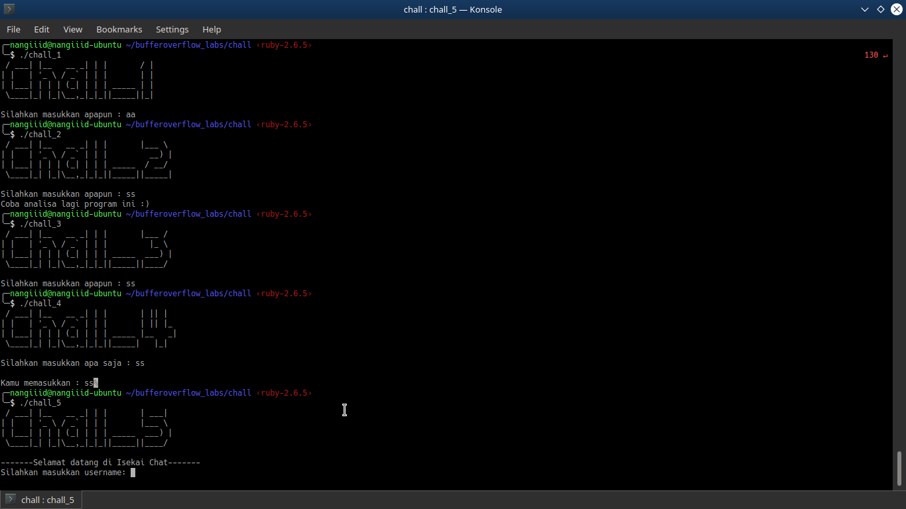
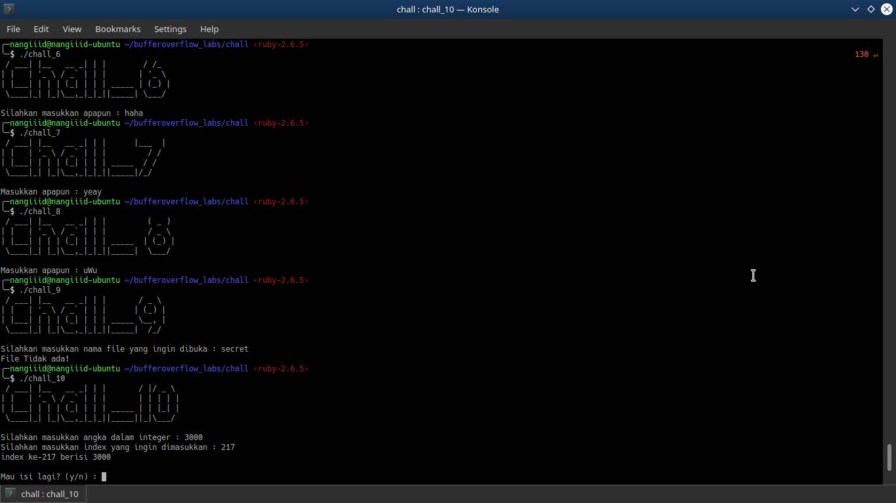

## Bufferoverflow Labs

 
Some simple 32-bit linux bufferoverflow challenge labs for new CTF player 

### List of Chall :
<pre>
~ Chall 1 | Signal
~ Chall 2 | Check
~ Chall 3 | Jump
~ Chall 4 | Strlen
~ Chall 5 | Scanf
~ Chall 6 | Calling Convention
~ Chall 7 | ROP
~ Chall 8 | ROP++
~ Chall 9 | Snprintf
~ Chall 10 | Array
</pre>

### Screenshot :
 

### Instalation :
<ul>
  <li>Clone this repo</li>
  <li>Make sure your OS is able to run 32-bit programs, if not you can googling about it</li>
  <li>Happy Hacking ^_^</li>
</ul>

 
 